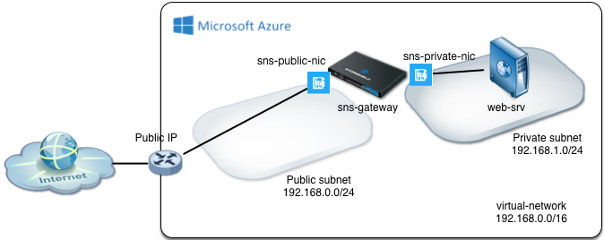

# Stormshield Network Security VM with 2 network interfaces

This Azure Resource Manager template deploys a SNS VM with 2 network interfaces in an existing VNET.

* The virtual network Appliance has a public subnet facing Internet.
* The virtual network Appliance has a private subnet for servers (or for temporary subnet with UDRs to be applied on other subnets)
* A route table is created to route trafic from the private network through the SNS appliance => Needs to be applied manually for each concerned subnets

## Next configuration steps:

* Setup Filtering and NAT masquerading for the Private subnet on the SNS appliance
* Assign subnets to the created UDR
* Deploy servers privates subnets
* Configure NAT redirection to publish services
